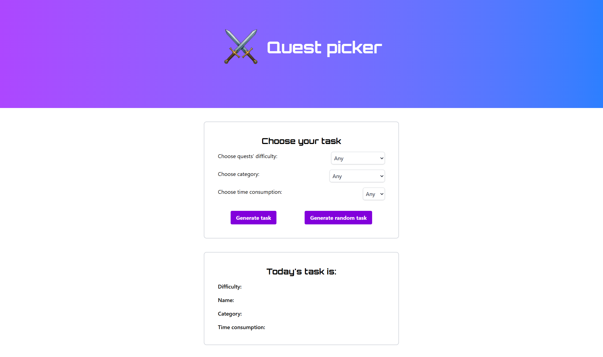

# 🧭 Quest Picker

A task picker I made to help me choose from my 365 tasks that I am completing over the next year. It includes both small and big tasks - whether it's tidying desk, walking my dog, doing yoga, or pushing forward on my programming journey.

## ✨ Features

- 🎲 **Random Quest Generator**  
  If you let all inputs on 'Any' you get a completely random task from the 365 options. This is in case I don't care what kind of task I get I just want help in deciding.

- 🎯 **Filtered Quest Generator**  
  Choosing a task based on:
  - Difficulty (`Daily Surviving`, `Normal`, `Challenging`, `Extra Challenging`)
  - Category (like `IT`, `Chores`, `Self Care`, `Dog`, and more)
  - Time Consumption (1 to 5 scale)

  This one helps if I have some more specific topic in mind and want to be able to customize my task to a degree.

- 📋 **Live Task Display**  
  See the selected task, along with all its informations (difficulty, category, and estimated time).

- 📋 **All Task Display**
  All tasks that fit the selection appears with all the informations. In case I want to have more flexibility in choosing.

## 🛠️ Tech Stack

- **React**
- **Tailwind CSS**
- **JavaScript**

## 🧠 How It Works

- Tasks are stored in `questLog.js` as an array of objects.
- The `App.jsx` lets you get random or filtered task
- `TaskForm.jsx` handles user selections.
- `Task.jsx` displays the task details.
- `AllFittingTasks.jsx`lists all tasks that match the selected filters.

## 💡 Future Ideas

- Add the ability to complete and track tasks
- Store progress in local storage or database

